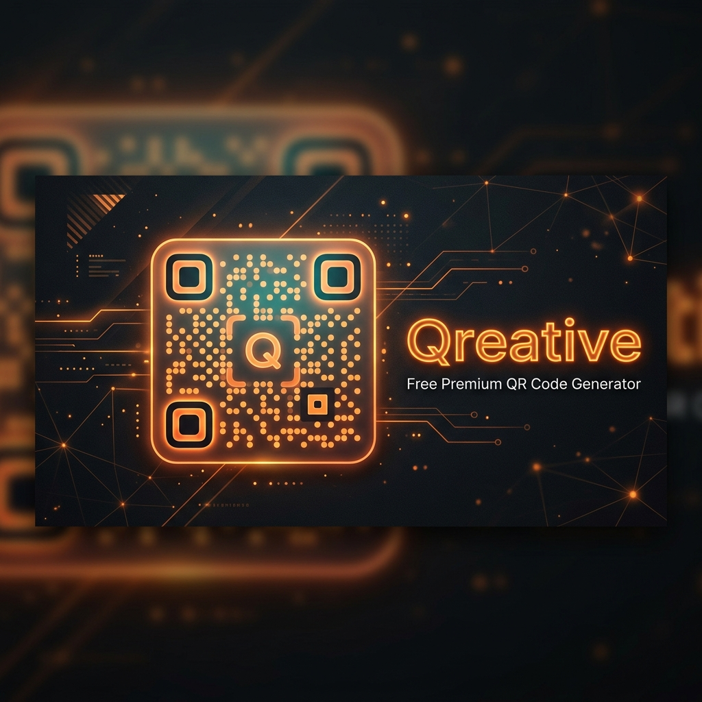

<div align="center">
  
  
  # 🟠 Qreative
  
  ### *Diseña códigos QR hermosos, personalizados y 100% privados.*
  
  [](https://astro.build)
  [](https://tailwindcss.com)
  [](https://opensource.org/licenses/MIT)

  [✨ Probar en Vivo](https://devcito.org) · [🛠️ Reportar Error](https://github.com/Programmercito/qr-generator/issues)
</div>

---

<p align="center">
  
</p>

**Qreative** es un generador de códigos QR moderno, estilizado y enfocado en la privacidad. A diferencia de otros generadores en internet que limitan las descargas, rastrean tus enlaces o cobran por exportaciones en formato vectorial, Qreative te permite diseñar códigos QR profesionales de forma **100% gratuita**, **sin marcas de agua** y de manera **totalmente local** (directamente en tu navegador).

---

## ✨ Características Principales

*   🎨 **Personalización Total:** Modifica la forma de los puntos (Redondeados, Extra Redondeados, Círculos, Líneas Elegantes, Cuadrados), los marcos de las esquinas (Finders) y el centro de los mismos.
*   🌈 **Colores & Degradados:** Soporte para colores sólidos o degradados (tanto lineales como radiales) con rotación personalizable para un branding perfecto.
*   🖼️ **Sube tu Logotipo:** Añade tu marca en el centro del código QR, personaliza su tamaño y margen, y activa la limpieza automática de fondo para garantizar la escaneabilidad.
*   💾 **Exportación en Alta Resolución:** Descarga tus QRs en formato **SVG** (vectorial óptimo para impresiones físicas de gran tamaño), **PNG** o **JPEG**. También cuenta con la función de copiar la imagen directamente al portapapeles.
*   🔒 **Privacidad Garantizada (Offline-first):** Todo el proceso se ejecuta del lado del cliente. Tus enlaces, credenciales de WiFi, datos de contacto o textos jamás se envían a servidores externos.
*   ⚡ **Presets Premium Integrados:** ¿No tienes tiempo de diseñar? Usa nuestros estilos predefinidos: *Stealth Carbon*, *Stealth Cyber*, *Obsidian Matte*, *Bionic Steel*, *Copper Alloy* o el diseño *Tradicional*.

---

## 🚀 Estructura del Proyecto

El proyecto sigue una estructura limpia y optimizada gracias a la arquitectura basada en componentes de **Astro** y la potencia de **Tailwind CSS v4.0**:

```text
/
├── public/                # Favicon, imágenes OG y recursos estáticos
├── src/
│   ├── assets/            # Activos o multimedia
│   ├── components/        # Componentes interactivos de Astro
│   │   └── Generator.astro # Interfaz del editor interactivo y lógica de generación
│   ├── layouts/           # Plantillas base de la aplicación (Layout.astro)
│   ├── pages/             # Enrutamiento de páginas (index.astro como landing principal)
│   └── styles/            # Estilos globales y tokens de diseño
│       └── global.css     # Importaciones de Tailwind CSS v4, animaciones y glassmorphism
├── astro.config.mjs       # Configuración del framework Astro
├── package.json           # Dependencias, scripts y configuración del motor Node
└── tsconfig.json          # Configuración del compilador TypeScript
```

---

## 🛠️ Stack Tecnológico

*   **[Astro (v6.3)](https://astro.build/)** - Framework web ultrarrápido orientado a componentes estáticos con hidratación parcial.
*   **[Tailwind CSS (v4.0)](https://tailwindcss.com/)** - Motor de estilos de última generación para lograr una UI responsiva, animaciones fluidas y efectos de glassmorphism premium.
*   **[qr-code-styling](https://github.com/kozakdenys/qr-code-styling)** - Biblioteca principal en Javascript para la generación y renderizado de QRs estilizados en Canvas/SVG.
*   **[Sharp](https://sharp.pixelplumbing.com/)** - Procesamiento de imágenes de alto rendimiento en el servidor para optimizar activos del build.

---

## ⚙️ Desarrollo e Instalación Local

Para levantar el proyecto en tu máquina local, sigue estos pasos:

### 1. Clonar el repositorio
```bash
git clone https://github.com/Programmercito/qr-generator.git
cd qr-generator
```

### 2. Instalar las dependencias
Este proyecto utiliza `pnpm` como gestor de paquetes principal:
```bash
pnpm install
```

### 3. Iniciar el servidor de desarrollo
Ejecuta el servidor de desarrollo local para ver tus cambios reflejados instantáneamente:
```bash
pnpm dev
```
La aplicación estará disponible en `http://localhost:4321`.

### 4. Compilar para Producción
Para generar una versión optimizada y lista para desplegar en tu hosting estático favorito (Vercel, Netlify, Cloudflare Pages, etc.):
```bash
pnpm build
```

---

## 💡 Recomendaciones de Escaneo

Para asegurar que tus códigos QR personalizados sean perfectamente legibles por todos los dispositivos:
1.  **Mantén el Contraste:** Usa siempre un fondo claro y puntos oscuros. Los contrastes invertidos (fondo oscuro con puntos claros) suelen dar problemas en algunas cámaras y aplicaciones de escaneo.
2.  **Tamaño del Logo Moderado:** Si insertas tu logotipo, procura mantener el tamaño por debajo del 25% y habilita el "margen" para despejar el área a su alrededor.
3.  **Aprovecha la Corrección de Errores (Redundancia):** Qreative viene configurado por defecto con redundancia de nivel `H` (High, ~30%), lo cual te permite obstruir parte del código con el logotipo sin perder la capacidad de escaneo.

---

## 📄 Licencia

Este proyecto está bajo la Licencia **MIT**. Eres libre de usarlo, modificarlo y distribuirlo comercial o personalmente.

---

<div align="center">
  <sub>Creado con el 🧡 por <a href="https://devcito.org">devcito</a></sub>
</div>
